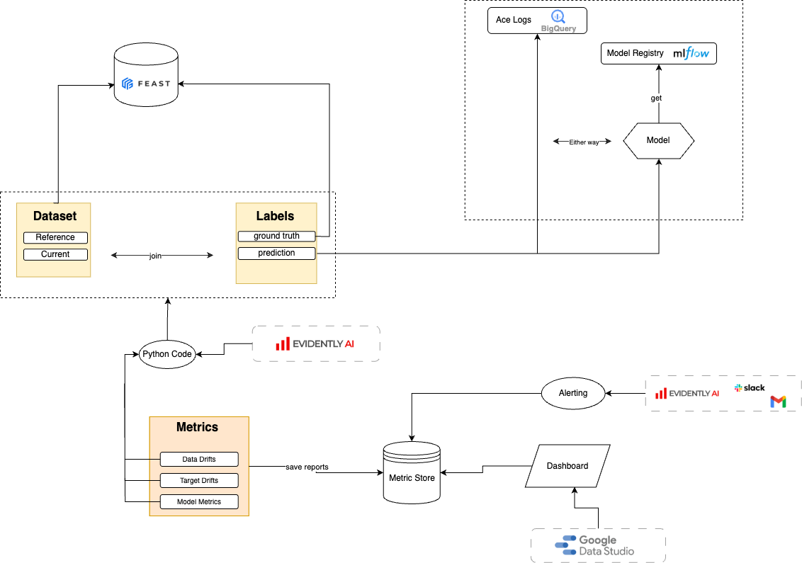
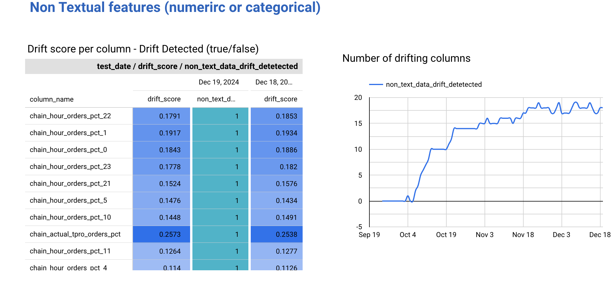
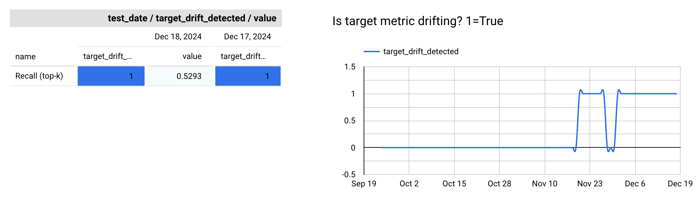
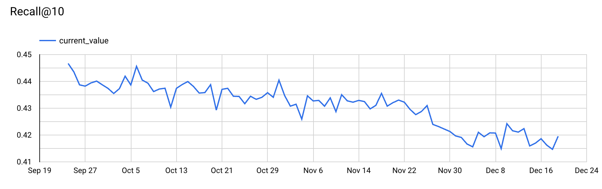

# Model Monitoring: Comprehensive Guide
[](https://evidentlyai.com/)
[](https://scikit-learn.org/)

## Content

- [Overview](#overview)
- [Core Components](#core-components)
  - [Data Collection](#data-collection)
  - [Drift and Metric Computation](#drift-and-metric-computation)
  - [Result Storage](#result-storage)
  - [Visualization](#visualization)
- [Directory Structure](#directory-structure)
  - [Key Files](#key-files)
- [Steps to Set Up Model Monitoring](#steps-to-set-up-model-monitoring)
  - [1. Data Collection](#1-data-collection)
  - [2. Drift Detection](#2-drift-detection)
  - [2.1. Target Drift Detection](#21-target-drift-detection)
  - [3. Performance Metrics](#3-performance-metrics)
  - [4. Save Results to BigQuery](#4-save-results-to-bigquery)
  - [5. Visualization](#5-visualization)
  - [6. Automation](#6-automation)
- [Extending to Other Use Cases](#extending-to-other-use-cases)
- [Customization](#customization)
- [Summary](#summary)
- [Documentation](#documentation)

## Overview



This guide provides a framework for monitoring machine learning (ML) models in production. It includes drift detection, performance metrics, and integration with visualization tools such as dashboards. The goal is to automate the monitoring process for any ML use case—classification, regression, ranking, multi-class, or even large language models (LLMs).


## Core Components

The model monitoring process includes:

1. **Data Collection**: Fetch reference and current datasets from a feature store. The dataset contains both true and prediction data. Predictions are obtained by performing inference using the MLflow model (our solution for managing model artifacts).
2. **Drift and Metric Computation**: Analyze data drift, target drift, and model performance metrics using tools like Evidently AI or scikit-learn.
3. **Result Storage**: Save results to a storage solution like BigQuery (BQ) for further analysis.
4. **Visualization**: Connect stored results to dashboards (e.g., Google Data Studio or Tableau) for continuous monitoring.

### Visualizations

To better understand the results of the monitoring process, here are some example visualizations:

- **Data Drift**:

  

- **Target Drift**:

  

- **Model Metrics**:

  


## Directory Structure

The monitoring system's project structure:

```
model_monitoring
├── bq
│   ├── create_monitoring_tables.py
│   └── monitoring_tables.yaml
├── data
│   ├── __init__.py
│   └── datasets.py
├── main.py
├── monitoring
│   ├── __init__.py
│   ├── data_drift.py
│   ├── model_metrics.py
│   └── target_drift.py
└── utils
    ├── __init__.py
    ├── data_loader.py
    ├── dates_handler.py
    ├── misc_utils.py
    └── performance_helpers.py
```

### Key Files

- `main.py`: Entry point for monitoring workflows.
- `datasets.py`: Defines the `Dataset` class for loading and preparing data.
- `data_drift.py`, `target_drift.py`, `model_metrics.py`: Handle specific monitoring tasks like drift detection and metric calculation.
- `create_monitoring_tables.py`: Scripts to set up BigQuery tables for storing monitoring results.

## Steps to Set Up Model Monitoring

### 1. Data Collection

The `Dataset` class is designed to handle and prepare feature and performance data for model evaluation. It supports both historical (Reference) and live (Current) datasets, making it agnostic to various types of tasks, including classification, regression, or ranking models. This class automates the process of collecting, processing, and preparing data, ensuring compatibility with model evaluation frameworks.

#### Overview

As part of model evaluation, you will typically need to compare model predictions with the true target values. The `Dataset` class allows you to automate this by:
1. **Collecting Features**: Extracting relevant feature data from both historical (Reference) and live (Current) datasets.
2. **Generating Predictions**: Using a stored model (in MLflow) to generate predictions on these datasets.
3. **Comparing with Ground Truth**: Comparing the model's predictions with the true target values to evaluate performance.

#### Example of Data Structure:

For both the **Reference** and **Current** datasets, the data contains key attributes such as `id`, `features`, `prediction`, and `target`. Here’s an example of what the data might look like:

| id   | feature_1 | feature_2 | prediction | target |
|------|-----------|-----------|------------|--------|
| 1    | 0.23      | 0.85      | 1          | 1      |
| 2    | 0.44      | 0.75      | 0          | 1      |
| 3    | 0.33      | 0.67      | 1          | 0      |
| 4    | 0.91      | 0.45      | 0          | 0      |

In this table:
- **Features**: Represent the input data used by the model.
- **Prediction**: The output predicted by the model for the given input.
- **Target**: The actual ground truth or the true label for that sample.

#### Key Concepts

- **MLflow Model**: The model you’ve stored in MLflow after training. This model is used to generate predictions during the evaluation phase.
- **Feature Data**: The input features (`feature_1`, `feature_2`, etc.) that are passed into the model for making predictions.
- **Prediction vs Ground Truth**: The key objective of model evaluation is to compare the model's predictions with the actual target values (the "ground truth"). This allows you to calculate performance metrics, such as accuracy, precision, recall, etc.

#### Creating the Dataset Class

To build a robust `Dataset` class for model evaluation, it is important to understand the components involved in preparing the data. Below is an overview of the steps:

#### 1. Initialization

The class should take parameters to define the dataset:
- **Country**: The country or region to filter data.
- **MLflow Model**: The trained model stored in MLflow, which will be used for making predictions.
- **Date Ranges**: Dates for both the reference and current datasets. The class should automatically pull data within these date ranges.

**Example**:
```python
from model_monitoring.data.datasets import Dataset

dataset = Dataset(
    country='AE',
    mlflow_model=model,
    start_reference_date='2023-01-01',
    end_reference_date='2023-01-31',
    start_current_date='2023-02-01',
    end_current_date='2023-02-28'
)
```

#### 2. Key Methods Creation

Here are the key methods within the Dataset class:

- `prepare_training_data`: Prepares data for training, including feature extraction and ground truth.
- `prepare_reference_data`: Prepares the historical (reference) data, including feature extraction, ground truth and predictions.
- `prepare_current_data`: Prepares the live (current) data, including feature extraction, ground truth and predictions.
- `process_data`: Processes data and make it usable by testing libraries (Evidently AI, sklearn) 
- `map_and_clean_id`: Maps and cleans item and user IDs across datasets to ensure compatibility.

### 2. Drift Detection

Use modules like `data_drift.py` or `target_drift.py` to analyze changes between reference and current datasets. Examples include:

- **Data Drift**: Changes in input feature distributions.

**Example:**

```python
from model_monitoring.monitoring.data_drift import DataDriftDetector

drift_detector = DataDriftDetector(
    reference_data=dataset.user_features_reference,
    current_data=dataset.user_features_current
)
data_drift = drift_detector.detect_drift()
```

### 2.1. Target Drift Detection

Target drift refers to changes in the distribution of the target variable between the reference and current datasets. This can be computed using a dedicated function:

**Example:**

```python
from model_monitoring.monitoring.target_drift import target_drift_test

target_drift = target_drift_test(
    reference_data=dataset.performance_reference, 
    current_data=dataset.performance_current
)
```

### 3. Performance Metrics

Compute model performance metrics (e.g., accuracy, precision, recall) using `model_metrics.py`.

**Example:**

```python
from model_monitoring.monitoring.model_metrics import MetricProcessor

metrics_processor = MetricProcessor()
model_metrics = metrics_processor.compute_metrics(
    reference_performance=dataset.performance_reference,
    current_performance=dataset.performance_current
)
```

### 4. Save Results to BigQuery

Store drift and metric results in BigQuery tables for further visualization and reporting.
Use `monitoring_tables.yaml` file to define table schemas.

**Example:**

```python
from model_monitoring.utils.bq_client import write_to_bq

write_to_bq(
    df=model_metrics, 
    table_name='project.dataset.model_metrics', 
    if_exists='append'
)
```

#### Example BigQuery Tables

**Target Drift Table (`[project_name]_target_drift`)**:

| test_date   | country_code | reference_start_date | reference_end_date | current_start_date | current_end_date | name              | description                                                                                 | condition_eq_value | condition_eq_relative | status   | value         |
|-------------|--------------|-----------------------|---------------------|---------------------|-------------------|-------------------|---------------------------------------------------------------------------------------------|--------------------|-----------------------|----------|---------------|
| 2024-10-27  | AE           | 2024-09-09           | 2024-09-16         | 2024-10-20         | 2024-10-27        | Recall (top-k)    | Recall@9 (no feedback users included) is 0.434. The test threshold is eq=0.433 ± 0.0433     | 0.43260431208313943| 0.1                   | SUCCESS  | 0.43429860428204192 |

**Data Drift Table (`[project_name]_data_drift`)**:

| test_date   | country_code | reference_start_date | reference_end_date | current_start_date | current_end_date | column_name | column_type | stattest_name           | stattest_threshold | drift_score         | drift_detected |
|-------------|--------------|-----------------------|---------------------|---------------------|-------------------|-------------|-------------|------------------------|--------------------|---------------------|----------------|
| 2024-11-22  | IQ           | 2024-09-09           | 2024-09-16         | 2024-11-15         | 2024-11-22        | tlabel      | text        | Absolute text content drift | 0.55               | 0.48672523399128909 | false          |

**Model Metric Table (`[project_name]_model_metric`)**:

| test_date   | country_code | reference_start_date | reference_end_date | current_start_date | current_end_date | metric_id    | k           | current_value |
|-------------|--------------|-----------------------|---------------------|---------------------|-------------------|--------------|-------------|---------------|
| 2024-09-24  | AE           | 2024-09-09           | 2024-09-16         | 2024-09-17         | 2024-09-24        | NoveltyMetric | 10          | 8.51173623670443 |

### 5. Visualization

Connect BigQuery tables to dashboards like Google Data Studio or Tableau to visualize monitoring results.

### 6. Automation

Automate the monitoring process using `schedule.yaml` file to define tasks and dependencies for your DAG. Ensure you add your section to the schedule file for your specific use case. Below is an example of the schedule configuration:

**Example Schedule Configuration:**

```yaml
tasks_group:
  - task_group_name: "model_monitoring_tasks_ae"
    gke_tasks:
      - task_id: "model_monitoring_gke_task_ae"
        node_pool: "default_node_pool"
        commands:
          - "python"
          - "main.py"
          - "--country=AE"
          - "--start_reference_date=2023-01-01"
          - "--end_reference_date=2023-01-31"
          - "--start_current_date=2023-02-01"
          - "--end_current_date=2023-02-28"
```

This approach ensures your DAG is properly scheduled and executed based on the task configuration.

## Extending to Other Use Cases

The same structure can be adapted for:

- **Regression**: Include metrics like RMSE, MAE.
- **Classification**: Monitor precision, recall, F1 score.
- **Multi-class**: Add confusion matrices.
- **LLMs**: Use metrics like BLEU, ROUGE for text tasks.

## Customization

You can replace Evidently AI with scikit-learn for simpler drift and metric computations:

**Example (Scikit-learn):**

```python
from sklearn.metrics import accuracy_score

accuracy = accuracy_score(
    y_true=dataset.performance_reference, 
    y_pred=dataset.performance_current
)
```

## Summary

This monitoring framework:

- Supports all ML use cases.
- Automates drift detection and metric calculation.
- Provides clear results stored in BQ tables.
- Enables visualization with dashboards.
- Is scalable and customizable based on specific requirements.

For questions or issues, consult Algorithm team or refer to the project’s documentation.


## Documentation

For more detailed documentation on how to use Evidently AI for model evaluation and other capabilities, you can refer to the official documentation:

[Evidently AI Documentation](https://docs.evidentlyai.com/)