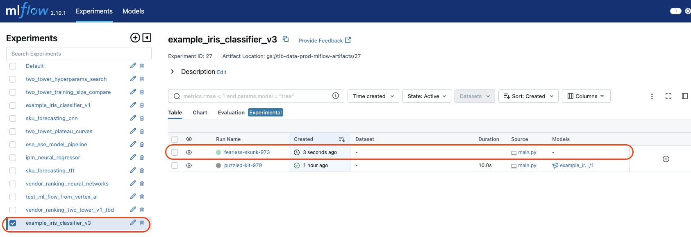
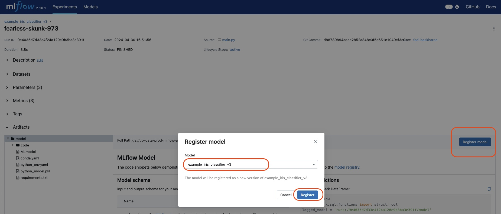
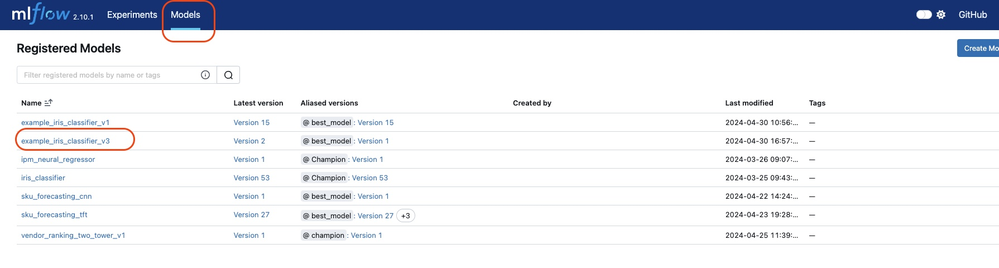
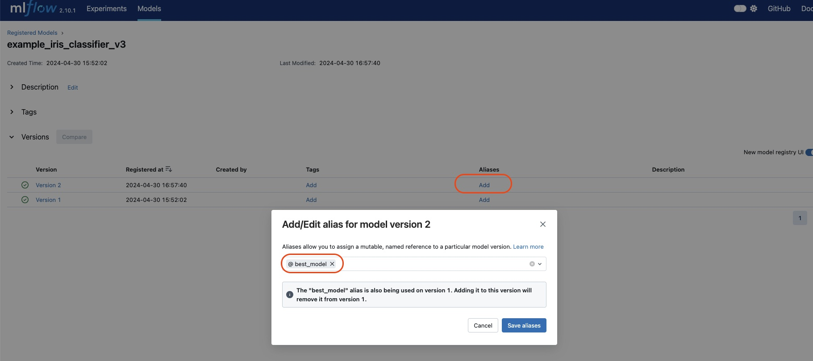

# 🚀 Data Algorithms Mlflow Repository 🌟

This repository is the vibrant heart that houses all the code relevant to algorithmic modeling at Talabat.\
It is more than just a codebase; it's a launchpad for your projects, where you can track your experiments,
and seamlessly move your models to production, whether batch processing using airflow or online serving using ACE.
Let's dive into how you can get started! 🌈

# 📝 Table of Contents

- [📚 Repository Structure](#-repository-structure)
- [🌟 Initilize your environment](#-initilize-your-environment)
- [🌱 Get started with a new project](#-get-started-with-a-new-project)
- [🔁 Tracking your experiment](#-tracking-your-experiment)
  - [`main.py`](#mainpy)
- [🎓 Model Serving (Online and Offline)](#-model-serving-online-and-offline)
    - [1. `model_wrapper.py` (Online or Offline serving)](#1-model_wrapperpy-online-or-offline-serving)
    - [2. Register your model to mlflow model registry (Online and Offline serving)](#2-register-your-model-to-mlflow-model-registry-online-and-offline-serving)
    - [3. `predict.py` (Offline serving only)](#3-predictpy-offline-serving-only)
    - [4. Move your pipeline to Airflow (Offline serving only)](#4-move-your-pipeline-to-airflow-offline-serving-only)

## 📚 Repository Structure
```
Root
  ├── base                             <- Contains the base classes and common utilities for all projects
  │     ├── v0
  │     │   ├── mlclass.py             <- Contains the base mlflow class 
  │     │   ├── mlutils.py             <- Contains the common mlflow apis. i.e. registering/loading a model to mlflow server
  │     │   ├── file_tools.py          <- Contains the common file operations needed for model logging
  │     │   ├── fs_utils.py            <- Contains the common file system operations. i.e. reading/writing from/to file system
  │     │   ├── db_utils.py            <- Contains the common database operations. i.e. reading/writing from/to BigQuery
  │     │   └── perf.py                <- Contains the common performance metrics calculations
  │     └── vn (Future versions)
  └── projects                         <- Contains all the algorithm related projects
        ├── <Project_1>
        │   ├── common                      <- Contains the shared code between models in the same project
        │   │   └── __init__.py
        │   ├── <Model_A>
        │   │       ├── README.md           <- The top-level README for developers using this project.
        │   │       ├── conda.yaml          <- The conda environment file for reproducing the analysis environment.
        │   │       ├── requirements.txt    <- The requirements file for reproducing the analysis environment.
        │   │       ├── model_wrapper.py    <- The model wrapper class to wrap your model into the Mlflow format.
        │   │       ├── main.py             <- The main training script and Mlflow logging
        │   │       ├── inference.py        <- The inference script for the model
        │   │       ├── schedule.yaml       <- The configuration file to schedule the scripts on Airflow (main.py, predict.py, etc...)
        │   │       ├── MLProject           <- The Mlflow project file for running the project. (Optional)
        │   │       └── model_config.yaml   <- The model configuration file for the project. (Optional)
        │   │    ...
        │   └── <model_N>
        │   ...
        └── <Project_2>
            ├── common
            ├── <Model_A>
            └── <Model_B>
```
## 🌟 Initilize your environment
#### 1. Clone the repository
#### 2. (Optional) Create a virtual environment
```bash
conda create -n <env_name> python=3.X
conda activate <env_name>
```
#### 3. Install basic requirements before you get started
```bash
pip install -r requirements.txt
```
## 🌱 Get started with a new project

#### 1. Create a branch for your project (from the main branch)

#### 2. Scaffold your project

From the root directory of the repository, run the following command:
```bash
python get_started.py
```
Then you are asked to enter the project name.
```bash
Enter the name of the project: 
```
If the project name exists already, you'll be asked if you just want to create a new model under the existing project.
```markdown
Project 'existing_project' already exists. Do you want to create a new model in this project? (yes/no): yes
```
If the project name doesn't exist, you'll be asked if you indeed want to create a new project.
```markdown
Project <new_project> does not exist. Do you want to create this project? (yes/no): yes
```
Finally, you are asked to enter the model name.
```
Enter the name of the first model:
```
You now have a dedicated directory under **projects/<project_name>/<model_name>** ready for development

## 🔁 Tracking your experiment 

### `main.py`
This is the main script that contains the training and evaluation logic of your model.
It is responsible to track the model's hyperparameters and performance and log them alongside the model to mlflow.

Example
https://github.com/talabat-dhme/data-ml-pipelines/blob/main/projects/example/iris_classifier_v3/main.py

<details>
<summary> Guidlines: </summary>

  - The code should be in a class format, with `__init__` and `__call__` methods, plus a method to log your model to Mlflow, typically `train`
  - `__init__` 
    - Do not remove the pre-set lines, as it loads the necessary environment variables to connect to mlflow server. 
    - Feel free to add any other parameters.
  - `__call__` 
    - The call method acts as the main function of your class, and is called when the class object is called.
    - It is the orchestrator of your code that calls any pre-processing, training, and evaluation methods.
    - This is what the DAG will be running.
  - `train` 
    - This method is used to log your model to Mlflow.
    - It should contain the `with mlflow.start_run()` block, and executes the main logic of your code.
    - It should log the model, metrics, and any other information you need.
  - `Other methods and scripts` 
    - Add as many other methods you need in this class
    - Add as many helping utils/scripts/etc... if needed
    - Common utilities should be added to the `common` directory
    - There is no restriction on the file naming, main.py is just a convention. you can use train,py or anything else.
    
</details>
    
    
**What if I want to use a notebook for interactive coding?**\
In order to keep your code always in sync and production ready, it is recommended to follow the following best practice:
1. Create a notebook in the same model directory. for example, `main.ipynb`, just beside the `main.py` file.
2. Import your class from the `main.py` file and use it in the notebook.
3. Move the tested methods to your class in the `main.py` file.
4. Test the code that will be put under `__call__` interactively in the notebook.

    <details>
    <summary>example notebook code</summary>
  
    ```python
    %load_ext autoreload                                # for automatic refresh of the imported modules
    %autoreload 2                                      
    
    from dotenv import load_dotenv                      # To load the environment variables
    load_dotenv()
    import sys                                          # To access scripts in the base directory or anywhere in the repo      
    repository_root_path = "../../.."
    sys.path.insert(0, repository_root_path)
    from main import ModelTrainer                       # Import the class from the main.py file
    
    # Other imports
    from projects.sku_forecasting.common.utils import get_training_data
    from base.v0.mlclass import logger
    from base.v0 import mlutils
    import pandas as pd
    

    trainer = ModelTrainer()    # Create an instance of your class
  
    # interactively test the code that will be put under __call__ method
    # "trainer" is the equivilant to "self" in your final script
    
    # Below is an example from the sku_forecasting project, tft model.
    logger.info("-- Retrieving the training data --")
    yesterday_str = (pd.Timestamp.today().normalize() - pd.Timedelta(days=1)).strftime("%Y-%m-%d")
    raw_data = get_training_data(
        sku_pattern=90243,
        end_date=yesterday_str,
        history_duration=450,
        warehouse_pattern='14807687-3b46-4ce6-b669-21f32d111652'
    )
    
    logger.info("-- tft model preprocessing --")
    raw_data = trainer.special_tft_preprocessing(raw_data)
    trainer.unique_categories = pd.DataFrame(list(set(zip(raw_data['country_code'], raw_data['sku'], raw_data['warehouse_id']))),
                               columns=['country_code', 'sku', 'warehouse_id'])
    
    trainer.unique_categories['country_code'] = trainer.unique_categories['country_code'].str.lower()
    train_dataloader, val_dataloader = trainer.prepare_time_series_data(raw_data)
    
    logger.info("-- Finding the best learning rate --")
    trainer.tft_parameters['learning_rate'] = trainer.get_best_learning_rate(train_dataloader, val_dataloader)
    
    logger.info("-- Training the model --")
    model = trainer.train_model(train_dataloader, val_dataloader)
    ```
    </details>

## 🎓 Model Serving (Online and Offline) 
The `model_wrapper.py` script is essential to wrap your model in the mlflow standard format, 
whether you are **offline serving** your model using airflow Or **online serving** it on ACE,

### 1. `model_wrapper.py` (Online or Offline serving)
This script is mostly set for you, it contains the class that wraps your model.\
Example: https://github.com/talabat-dhme/data-ml-pipelines/blob/main/projects/example/iris_classifier_v3/model_wrapper.py

<details>
<summary> Guidlines: </summary>

  - This is an mlflow standard class with `load_context` and `predict` methods.
  - `load_context` 
    - This method is used to load the model and any other artifacts needed for the model.
    - You should implement the appropriate way to load each artifact.
  - `predict` 
    - This method is used to make predictions using the loaded model.
    - it receives a dictionary in case your model has multiple inputs.
    - It should return the prediction result.
  - `get_sample_input` *Optionally*
    - This method is used to generate a sample input for your model, it is used to test your model.
    - It should return a dictionary of the model input(s).
</details>

<div style="display: flex; align-items: center; gap: 10px;">
    <h3>2. Register your model to mlflow model registry (Online and Offline serving)</h3>
    
</div>

- First, Make sure the model_wrapper.py file is correctly configured
- Second, Register your model manually or programatically as in the guide below.
- Finally, when registering the model, you need to set an alias to it so that:
  - For **Online serving** models, ACE team knows that this model is meant for online serving using ACE.
    - ACE staging alias: `ace_champion_model_staging`
    - ACE production alias: `ace_champion_model_prod`
    - Some **model tags** might be required by ACE team, like `country_code`, `model_ready_to_deploy`, etc... (Refer to ACE team)
  - For **Offline serving** models, your predict.py script can refer to the right model.
    - Any alias you want, `best_model` is a common one.
    
**Guide**
   <details>
       <summary> 1. Register a model manually using the mlflow server</summary>
          Step1: Go to the <a href="https://data.talabat.com/services/mlflow/" title="Go to Google">mlflow server</a>
          and choose the corresponding experiment and run names.
                    <div style="display: flex; align-items: center;">
                      
                    </div>
          Step2: Click on the "Register Model" button, and give a name to your model (typically, same as the model name in the experiment name)
                    <div style="display: flex; align-items: center;">
                      
                    </div>
          Step3: Go the model tab and choose the corresponding model name
                    <div style="display: flex; align-items: center;">
                      
                    </div>
          Step4: Go Add an alias to the model version you just registered. This is the name that you will use to refer to the model in the predict.py script.
                    <div style="display: flex; align-items: center;">
                      
                    </div>
  </details>
  <details>
      <summary> 2. Register a model using mlflow api </summary>
      
     ```python
     from base.v0 import mlutils
  
     # Get the latest run 
     run = mlutils.get_latest_run('sku_forecasting_tft')
     
     # Register the model with an alias
     mlutils.register_model(
         model_name='sku_forecasting_tft',
         run=run,
         alias = 'best_model' # FOR OFFLINE SERVING
     )
     ```
  </details>

### 3. `predict.py` (Offline serving only)
It is the entrypoint to run predictions using your registered mlflow model.
For example: Loading the model, preprocessing the input, running predictions, post-processing the output, pushing data to a database, etc...

Example:
https://github.com/talabat-dhme/data-ml-pipelines/blob/main/projects/example/iris_classifier_v3/predict.py

<details>
<summary> Guidlines: </summary>

  - The code should be in a class format, with at least `__init__` and `__call__` methods.
  - `__init__` 
    - Do not remove the pre-set lines, as it loads the necessary environment variables to connect to mlflow server. 
    - Feel free to add any other parameters.
  - `__call__` 
    - The call method acts as the main function of your class, and is executed when the class object is called.
    - This is what the DAG will be running.
  - `Other methods and scripts` 
    - Add as many other methods you need in this class
    - Add as many helping utils/scripts/etc... if needed
    - Common utilities should be added to the `common` directory
    - There is no restriction on the file naming, predict.py is just a convention. you can use inference.py or anything else.
</details>

<div style="display: flex; align-items: center; gap: 10px;">
    <h3>4. Move your pipeline to Airflow (Offline serving only)</h3>
    
</div>
  In order to turn any of your entrypoints (main.py, predict.py, etc...) into a scheduled job using airflow, you simply need to:
  
  1. Make sure the `requirements.txt` has all the necessary dependencies.
      <details>
      <summary>How to Automatically generate it</summary>
     
      1. From the model directory, run the following command
      ```bash
       pipreqs ./
      ```
      2. Manually inspect the generated **requirements.txt** file and remove any unnecessary dependencies.
  
     </details>
     
  2. Configure `schedule.yaml` which contains the scheduling details, owner, node pool, and commands to execute. 
     <br> Just set `enable_dag: true` in the schedule.yaml file after reviewing the DAG details to enable it.

`responders_name` and `responders_email` come from the [teams data class](https://github.com/talabat-dhme/data-dags/blob/develop/data_algorithm/mlflow_dags/parameters/responders.py).
<br> Your DAG will appear automatically in the Airflow UI after merging your branch to (develop --> staging airflow) or (main --> production airflow).

# **That's it!**  🎉

## FAQ
**1. Why is it a mono-repo for all the projects?**
- Because of the common workflow between projects after being merged to the main branch.
- In order to use common utilities such load/write data, register/load mlflow model, etc...
- To follow a unique project structure, easy for everyone to follow
- To apply common changes on all projects in an easy way

**2. Why do I need to start my project using the get_started.py script?**
- It generates the necessary files for you
- It sets up the environment variables with the standard naming of the experiment which is <project_name>_<model_name>
- This is essential to link the source code with the registered models

**3. What if I want to work on vertexAI?**
- You can still use the jupyter's terminal to clone the repository and work as if you're working locally

**4. What is the base directory for?**
- It contains the common utilities that are shared between all projects, such as mlclass, mlutils, file_tools, etc...
- It is a good place to put any common utility that is shared accross all projects
- It is versioned to avoid breaking changes

**5. What is the common directory for?**
- It contains the shared code between models in the same project
- It is a good place to put any common utility that is shared between models in the same project
- The structure of the common directory is flexible up to the project needs

**6. How can I test my model before deploying it?**
- You can load the registered model using the mlflow api and test it using the predict.py script

## Contribution Process:
- Create bugfix/feature branch from main.
- Implement your code changes.
- Create a PR against develop.
- Make sure all your changes going in develop are correct and no unintended changes are going in develop.
- Merge the PR in develop.
- Wait for Dev Cloudbuild to complete deploying to Dev Airflow.
- Verify your changes in Dev Airflow and make sure testing is successful, verify nothing is broken.
- Create a PR from the original branch to main. Make sure no unintended changes are going in main.
- Merge the PR to Main ONLY after at least one approval.