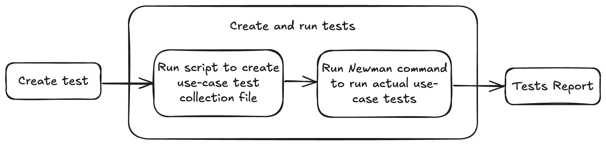

# API Testing

Hi! This doc is intended to guide you on writing api tests. Enabling api test creation for both model and ace servers, both on QA and Prod.

## Local Environment Setup

**To run tests locally connection to VPN is required!**

1. Install Node and NPM:
`brew install node`
2. Verify installation:
`node -v`
`npm -v`
3. Install Newman
`npm install -g newman`
4. Verify installation:
`newman -v`

## prerequisite
Deploy ace/model version you intend testing on QA or Prod. To trigger api server tests.

# Experience

API testing consists of two parts:
1. Creating a collection json test file per use-case. 
2. Running this file using newman CLI to run tests and report results.

This section will guide on how to create api tests, where to add them and how to add their config.

## Where to create the API tests directory ?

Under **Projects** directory. Each "use case" directory, should have an **api-tests** directory defined under it! This directory is where we will create tests related to parent use case directory.

**api-tests** directory can be defined in any level inside projects directory tree,
for example:

    projects/ 
    │ 
    ├── vendor_ranking/ 
    │	├── two_towers/
    │ 	│ 	├── api-tests/
    │ 	│ 	│	└── ... 
    │	├── session_based/
    │ 	│ 	├── api-tests/
    │ 	│ 	│	└── ... 
    │ 	
    ├── item_ranking/ 
    │ 	├── api-tests/
    │ 	│	└── ... 

## "api-tests" directory

Directory will consist of all api tests related to this particular use-case.
Each test should be defined in its unique directory.

    projects/ 
    │ 
    ├── vendor_ranking/ 
    │	├── two_towers/
    │ 	│ 	├── api-tests/
    │       │ 	│ 	├── test_1/
    │ 	│ 	│	│	└── ... 
    │       │ 	│ 	├── test_2/
    │ 	│ 	│	│	└── ... 

## Test directory

### Test Directory Name
Let's follow the following structure for standardization across all implementations:

    test_{description}_{stage}/
        
> test_missing_chains_qa/
> 
> test_500K_chains_success_prod/

Test name will be defined from the test directory name!

### What should directory consist of ?
Each directory will consist of three files:

    - config.py
    - req.json
    - res.json
 
 The **config.py** defines test config.
 **req** and **res** files will define api test input vs output for assertion!

### Config file
The config file will consist of three main parts

    1. URL definition
    2. Assertions Definition
	    - status code
        - method (http method - optional, by default "POST")
    3. Optional Assertions Definition
	    - headers
Upon feedback the list of assertions can be modified to add more assertions if needed.

**Here is an example!**
This test is defined to test Vendor Ranking Ace 2.0 API, on QA environment.

    setup:  
	  url: https://ace-qa.dhhmena.com/v2/vendor_ranking/sort  
      method: "POST"
	  assertions:  
	    status_code: 200  
	    
	    optional:  
	      headers:  
	        - ["Content-Type", "application/json"]

### Req Json file
The request file contains API request body.
 **Example:**
This is an ace request body testing sending a request to hugging face model, with no chains inside the request.

    {  
	  "timestamp": "2023-08-21T01:39:05.2306478+00:00",  
	  "device_source": 0,  
	  "app_version": "",  
	  "customer_id": 33965741,  
	  "model_nickname": "hugging_face_v1",  
	  "locale": "en-US",  
	  "location": {  
	    "country_id": 4,  
	    "country_code": "ae",  
	    "city_id": 35,  
	    "area_id": 7569,  
	    "latitude": "25.2048493",  
	    "longitude": "55.270782800000006"  
	  },  
	  "vendors_df": {  
	    "chain_id": [  
	    ],  
	    "vendor_id": [  
	    ],  
	    "status": [  
	    ]  
	  }  
	}

### Res Json file
The response file contains expected response body to be later asserted against real response coming from api call.
**Example:**
For above example we should expect receiving an empty array

    []
 
## Final Project Structure

    projects/ 
    │ 
    ├── vendor_ranking/ 
    │	├── two_towers/
    │ 	│ 	├── api-tests/
    │       │ 	│ 	├── test_empty_chains_list_prod/
    │ 	│ 	│	│	└── config.py
    │ 	│ 	│	│	└── req.json
    │ 	│ 	│	│	└── res.json
    │       │ 	│ 	├── test_3K_chains_list_qa/
    │ 	│ 	│	│	└── config.py
    │ 	│ 	│	│	└── req.json
    │ 	│ 	│	│	└── res.json

# Run

## Build & Run Tests Collection file for specific directory (Single Use-case)
Will **build and run** collection test json file for passed **api-tests** specific directory, and will place the output file inside same passed directory.

    just api-tests-build-run-dir directory_path
example:

    just api-tests-build-run-dir ./projects/vendor_ranking/two_towers/api-tests

## Build & Run All API tests
Will run test collection json files for all use-cases under **projects** directory

    just api-tests-build-run

## Build Tests Collection file for specific directory (Single Use-case)
Will create collection test json file for passed **api-tests** specific directory, and will place the output file inside same passed directory.

    just api-tests-build-dir directory_path
example:

    just api-tests-build-dir ./projects/vendor_ranking/two_towers/api-tests

## Build Tests Collection file for all projects directory
Will fetch all **api-tests** directories under **projects** directory, and will create collection test file for each **api-tests** directory and place within same directory.

    just api-tests-build

## Run Single Use-case API tests
Will run test collection json file for specific use-case

    just api-tests-run-dir directory_path
example:

    just api-tests-run-dir ./projects/vendor_ranking/two_towers/api-tests

## Run All API tests
Will run test collection json files for all use-cases under **projects** directory

    just api-tests-run