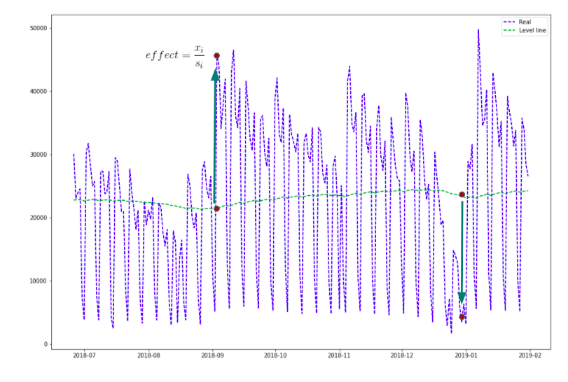
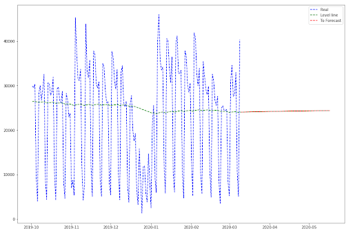

# Calendar Forecast

Forecast using seasonality. So far, implemented effects are:

* `Calendar` - Seasonality due to date of year
* `Holidays` - Holidays days given as file parameter
* `Special_events` - Special events given as file parameters (e.g marketing promotion)

## Smoothing & Effects Learning



For a given value, effect is [smoothed_value] / [timeseries_value]

## Forecast



Level line in red is used as a beseline for forecast:

The forecast will be [level_line] * [effect at this date]

## Package usage

#### How to use:

-Install package: `pip install .`


-Prepare your timeseries to forecast:
```py
import pandas as pd

df = pd.read_csv('test_dataframe.csv', index_col=None)
df = df[["date_sql", "net_valuated_price"]]

df.columns = ["date_sql", "y"]
```

-Prepare your model to forecast:

```py
from timeseries_forecast_tool.calendar_forecast import CalendarForecast

smoothing_params = {'span': 500, 'beta': 0.0005, 'damped': 1}
calendar_forecast = CalendarForecast(smoothing_params, n_days=100, effects_names=["holidays"])

calendar_forecast.prepare(df)
calendar_forecast.fit(df)
```

Args:

* ```n_days```: number of days to forecast

* ```smoothing_params```: dictionary of smoothing params (keys must be 'span', 'beta', 'damped')

* ```effects_names```: List of effects names. Possibles values are:
    * `date_of_week_of_month`: Effects due to seasonality
  
    * `holidays`: Effects due to holidays days (file must exist)
  
    * `special_events`: Effects due to special events (file must exist)
    

-Finally, forecast:
```py
forecast_dataframe = calendar_forecast.predict(df)
```


#### Important:

In order to use the parameter list `effect_names`, one should create respectively the following files for parameter:


* ```holidays```: <em>holiday_days.csv</em>.

* ```special_events```: <em>events_days.csv</em>.


    * These files must be in a directory called <strong>key_dates_files/</strong>
    * This directory location must be at the root of your project.

> See examples of such files: [Here]()


<u>Example of project structure</u>:

    ├── forecast_talabat_revenue
    │   ├── cli
    │   │   └── model.py
    │   ├── data
    │   │   ├── fetch.py
    │   │   └── queries
    │   │       └── get_revenue.sql.j2
    │   └── utils
    │       ├── log.py
    ├── key_dates_files
    │   ├── anomalies.yml
    │   ├── events_days.csv
    │   └── holiday_days.csv
    ├── requirements.txt


#### Anomalies and Outliers Handling:
During model fitting, non quality data (e.g Anomalies) and outliers are skipped so that model doesn't learn their effetcs.

* Anomalies dates are known events that one intentionnaly specify (<strong>anomalies.yml</strong>), such as <strong>COVID-19, bugs</strong>, because they have impact on data quality as they are exceptionnal and uniques.

* Outliers are automatically learned by the algorithm. The way it does is as simple as the following: if smoothed value is ```4 times``` bigger than timeseries value or if it is less than ```0.01``` * timeseries value, then it's an outlier.
The outlier check will be made only on non special days (`holidays` or `special_events`)


<u>Example of Anomalies file</u>:

```yaml
anomalies:
  covid_19:
    descritpion:
      period of covid19 pandemy and lockdowns
    type:
      range
    date:
      start: 2021-03-01
      end: 2021-10-01
  bug:
    descritpion: bug in servers
    type: unique
    date: 2022-01-01
  prod_KO:
    descritpion: fake event
    type: unique
    date: 2018-01-01
``` 