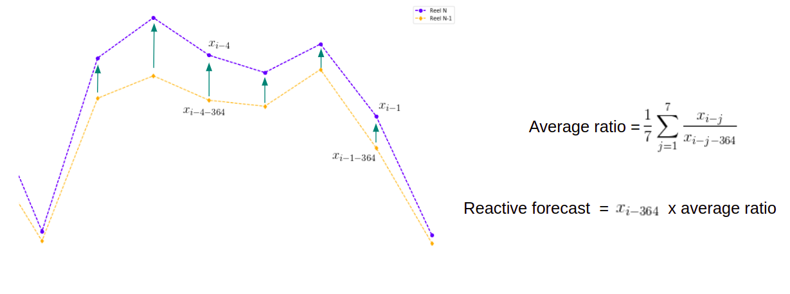

# Reactive Forecast
Forecast using YoY increase rate:
Forecast = last_year_value * increate rate

## Forecast



The forecast will be [last_year_value] * [increase_rate]

## Package usage

#### How to use:

-Install package: `pip install .`


-Prepare your timeseries to forecast:
```py
import pandas as pd

df = pd.read_csv('test_dataframe.csv', index_col=None)
df = df[["date_sql", "net_valuated_price"]]

df.columns = ["date_sql", "y"]
```

-Prepare your model to forecast:

```py
from timeseries_forecast_tool.reactive_forecast import ReactiveForecast

reactive_forecast = ReactiveForecast(n_days=100)
reactive_forecast.prepare(df)
```
Args:

* ```n_days```: number of days to forecast

-Finally, forecast:
```py
forecast_dataframe = reactive_forecast.predict(df)
```


