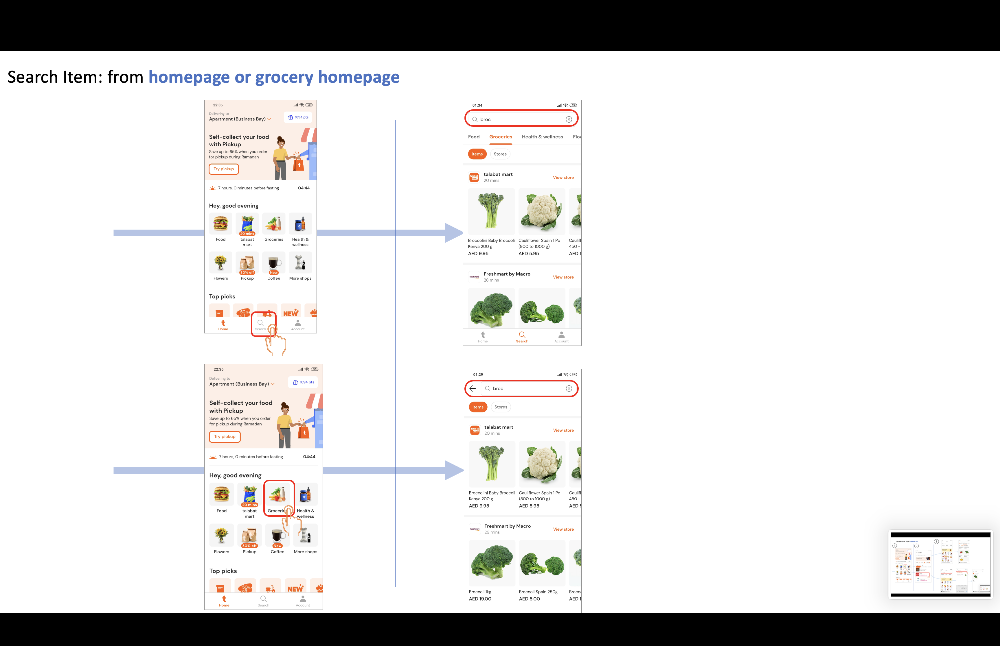
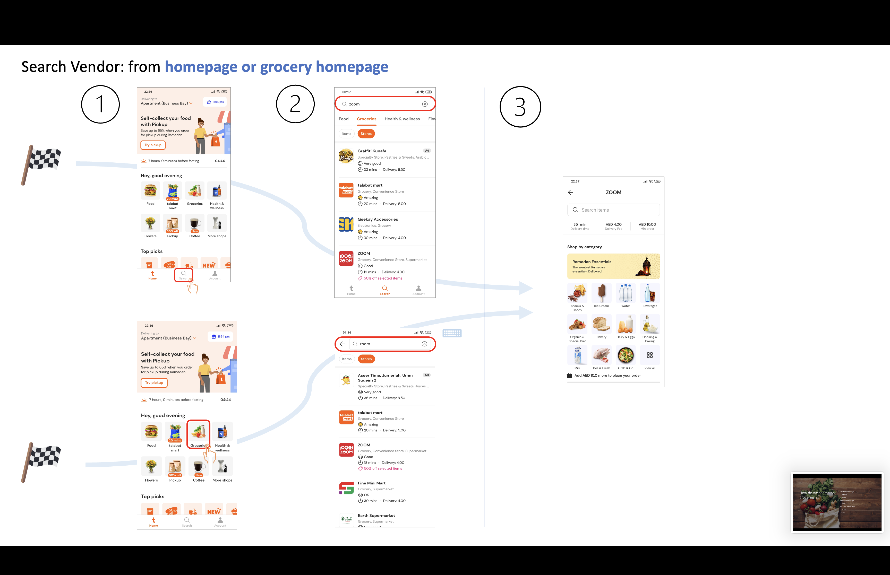
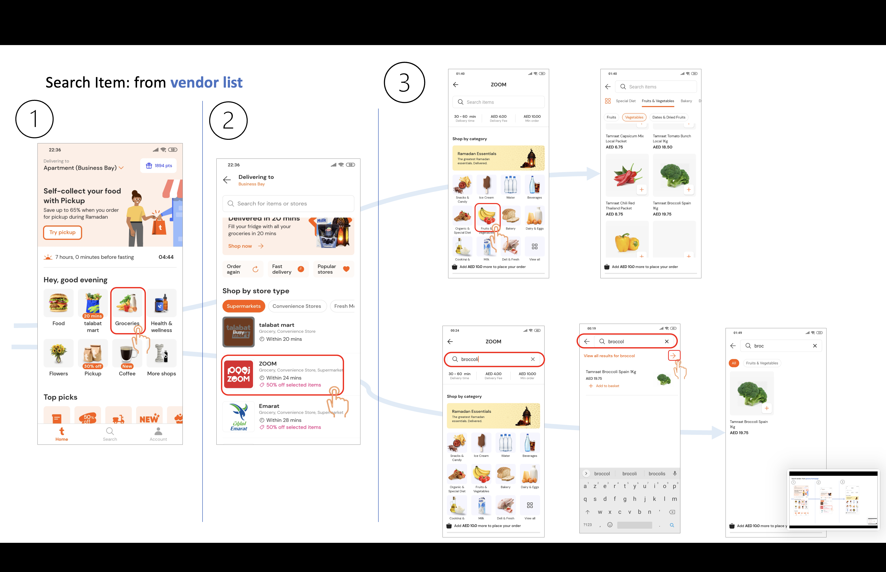

# Problem Statement:

Currently, searches grocery search performances are not optimal. This might be due to:

* Assortment issues
* Missing vendors
* Inexact meta data 
* Out of stocks items

# Search on Grocery

Quickly said, users can search from 2 starting points:

* App Homepage
* Grocery Homepage

They can search either for Items or Vendors (store)

-For example, search for an item: 


-For example, search for a vendor: 



Finally, one can search for an item in vendor's menu.



The app performance scope is one the 2 first category only, in vendor search will be implemented soon.

## App Usage

The app purpose is to show performance for groceries users search queries on Talabat app for all the Region's country.
On top of that, rule based query clustering will be displayed. (see section Clutering)

One can choose which axe of anlayse they want using selectbox parameters filters


### Filters:

Args:

* ```OS```: Android or iOS
* ```Language```: query Search language
* ```search type```: Items or Stores(=groceries) search
* ```country```: 
    * United Arab Emirates
    * Saudi Arabia
    * Qatar
    * Oman
    * Kuwait
    * Jordan
    * Egypt
    * Bahrain
* ```City```: Cities for selected country
* ```Area```: Areas for selected country

### Clustering: (WIP)

For every filtered values, app will display computed clusters of queries.


* Worst Performing Queries

    CTR > x% 
    
    &
    
    CVR < x%

* Normally Performing Queries 

* Best Performing queries


    

# Contact

For any information, improvement suggestion, wishes to contribute please contact:

- Hafed Rhouma: hafed.rhouma@talabat.com
- Ashhad Azam: 
- Grocery Data Team: 